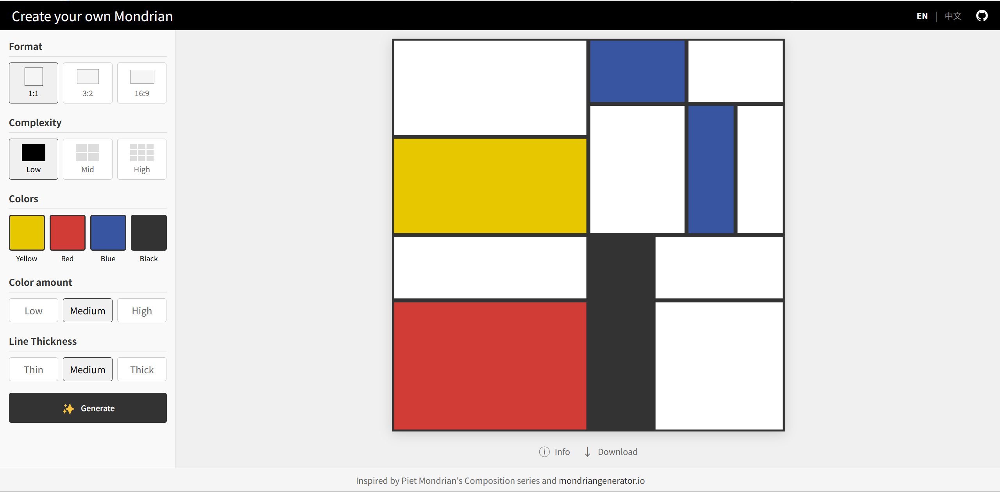

# 🎨 Open Mondrian
<p align="center">
  <a href="https://open-mondrian.vercel.app/">
    
  </a>
</p>

> Mondrian hoped to convey the idea of the eternal movement of life in his works. He believed that this goal could be subtly achieved by changing the width of black lines. He reasoned that the thinner the line, the faster the eye "reads" its trajectory, and vice versa. By adjusting the width, he could manipulate lines much like pressing the accelerator of a car. This, in turn, would help him achieve his ultimate goal: to imbue his paintings with a sense of "dynamic balance."
> 
> -- Will Gompertz, "What Are You Looking At?"

## 🌐 Live Demo

Check out the live application on [Vercel](https://open-mondrian.vercel.app/)

## 📖 About

Open Mondrian lets you create artwork inspired by Piet Mondrian's Composition series. Adjust various parameters to explore the principles behind his abstract compositions.

## ✨ Features

- Generate compositions with a recursive algorithm
- Customize format, complexity, colors, and line thickness
- Multilingual support (English and Chinese)
- Download creations as SVG files
- Optimized for performance

## 🚀 Getting Started

### Prerequisites

- Node.js (v14 or later)
- npm or yarn

### Installation

```bash
git clone https://github.com/jaceyang97/open-mondrian.git
cd open-mondrian
npm install
npm start
```

Open [http://localhost:3000](http://localhost:3000) to view it in the browser.

## ⚙️ How It Works

1. Starts with a single cell representing the canvas
2. Recursively splits cells horizontally or vertically
3. Assigns colors based on palette and probability
4. Renders cells and grid lines on canvas

## 💻 Technical Details

- Built with React and TypeScript
- Styled with styled-components
- Optimized with React.memo, useMemo, and useCallback
- Responsive design for mobile and desktop
- Multilingual support with context API

## 📄 License

MIT License

## 🙏 Acknowledgments

Inspired by [mondriangenerator.io](https://www.mondriangenerator.io/) and the works of Piet Mondrian, of course.


## TODO
- [ ] If a color is selected, then it must be used in the composition